# Chord Conditioned Melody Generation with Transformer Based Decoders

paper

## **0. Overview**

- chord conditioned melody 생성 모델 CMT(Chord conditioned Melody Transformer)
- Chord Encoder(CE), Rhythm Decoder(RD), Pitch Decoder(PD)로 구성
- 2단계의 training prcedure: 주어진 chord 진행에 대해 먼저 rhythm을 생성하고, rhythm에 따른 pitch sequence 생성

## **1. Related Work**

### **1) Chord conditioned music generation**

- JamBot: chord 진행 생성 및 chord conditioned polyphonic 음악 생성
    - 예측된 chord가 부정확할 수 있고 오직 triad에 한정됨
    - chord가 one-hot 벡터로 표현되어서 다른 chord들 사이의 관계 파악 불가
- MIDINet: multitrack 음악 생성
    - chord vector를 root note를 나타내는 12 dimension의 one-hot 벡터와 major/minor를 나타내는 추가적인 1개의 dimension, 총 13개 dimension으로 구성
    - root note와 chord type 측면에선 chord들의 관계를 나타낼 수 있지만, 오직 24개의 triad에 한정됨
- CRMCG(Chord based rhythm and melody cross-generation model)
    - chord GRU와 각각 rhythm, melody를 위한 2개의 auto-encoder로 구성
    - chord vector가 rhythm decoder에 들어가지 않기에(melody encoder와 rhythm encoder의 output이 rhythm decoder로, melody encoder와 chord GRU의 output이 melody decoder로) chord에 사용된 rhythm이 melody에 사용된 rhythm과 관계가 있다고 할 수 없음
- EC2-VAE(Explicitly-constrained conditional variational auto-encoder)
    - chord와 melody에서 rhythm과 pitch의 latent variable 추출
    - rhythm decoder가 latent rhythm variable로부터 rhythm token의 분포 추정
    - global decoder가 이 분포를 받아서 melody reconstruct
    - **이와는 다르게 본 논문은 pitch decoder가 rhythm decoder의 분포로부터 샘플링된 rhythm token을 input으로 받음**

### **2) Attention Mechanism and Music Transformer**

- 더 긴 sequence를 처리할 수 있는 [memory efficient relative self-attention model](https://openreview.net/pdf?id=rJe4ShAcF7)
    - Music Transformer는 transformer의 decoder 차용
    - encoder output에 대한 attention 없음(encoder 없기 때문에)
    - **rhythm과 pitch decoder에 이 구조 차용**

## **2. Methods**

### **1) Data Representation**

- chord vector c는 12 dimension의 binary vector로 표현, 각 요소는 chord의 활성화된 pitch class
- rhythm vector r은 3 dimension의 one-hot(onset of a note, holding state of an onset note, rest)
- pitch vector p는 50 dimension의 one-hot(첫 48 dim은 onset of MIDI pitch from 48 (C3) to 95 (B6), 나머지 둘은 holding state와 rest)

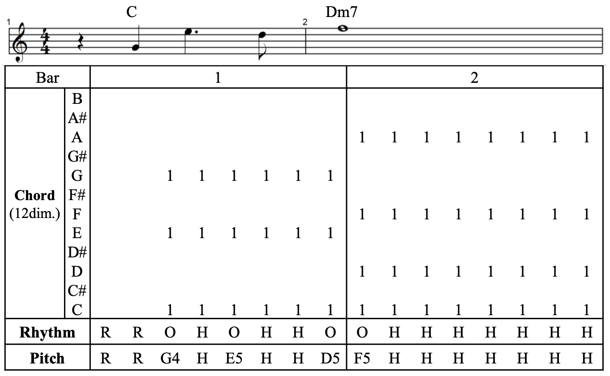 

- 최소 단위는 16분음표

### **2) Model Architecture**

**2-1) Chord Encoder (CE)**

- transformer의 self-attention encoder를 bidirectional LSTM으로 대체 → loss의 변동성 줄임

**2-2) Rhythm Decoder (RD)**

- N개의 self-attention block의 stack
- 오직 이전 time-step의 rhythm sequence만 사용 가능, 나머지는 마스킹
- CE의 output과 마스킹된 rhythm sequence가 input
- output layer는 FC layer와 softmax layer → rhythm token에 대한 확률 분포로 바꿔줌

**2-3) Pitch Decoder (PD)**

- N개의 self-attention block의 stack
- chord와 rhythm 전체 sequence 이용 가능
- rhythm encoder 추가 학습하는 대신, RD의 intermediate rhythm representation 재사용
- 추가적으로 이전 time-step의 pitch token 사용

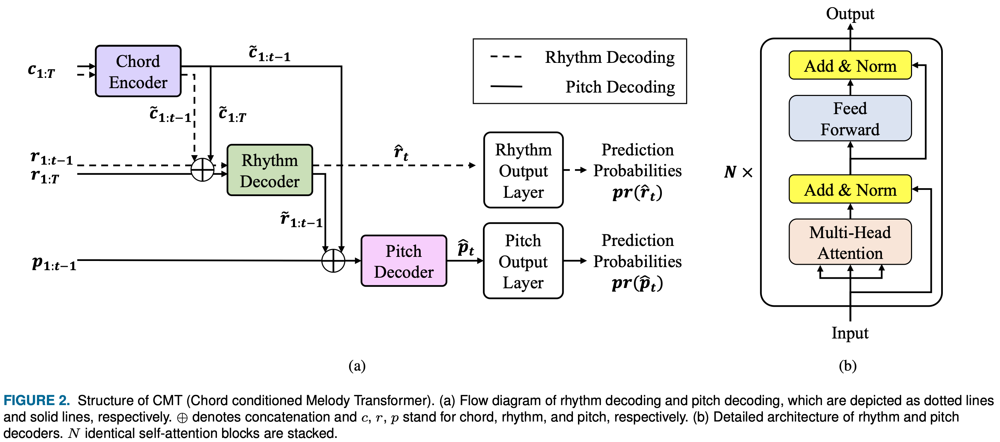 

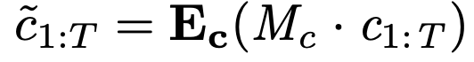 

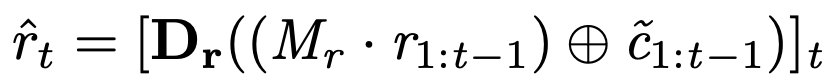 

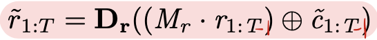 

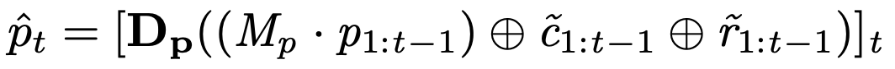 

### 3) Two-Phase Training

- first phase
    - RD 학습
- second phase
    - pre-train된 RD 이용해서 PD 학습
    - PD에서 RD의 intermediate rhythm representation이 필요하므로 RD parameter도 loss에 포함
    - pitch loss에 대해서만 back propagate하면 pre-train된 RD의 performence를 하락시킬 수 있기 때문에 rhythm loss와 pitch loss의 합을 최소화함으로써 RD와 PD를 함께 train

### 4) Pitch varied Rhythm data

- pitch class의 분포가 key에 따라 다르기 때문에, 여러 학습 데이터에서 여러 key들은 PD의 학습 방해 가능성
    - 모든 학습 데이터는 하나의 key로 shift: C for major, A for minor
    - PD는 둘 중 하나의 key의 멜로디를 생성, 다른 key의 멜로디는 이를 특정 semitone만큼 이동시켜서 생성 가능
- RD 학습 시 rhythm에 대해서는 하나의 key로만 구성된 데이터보다는 pitch가 다양한 데이터셋이 유리
    - 하나의 데이터에 대해 다른 11개의 key로도 shifting해서 사용
    - 하나의 데이터에 대해 rhythm은 동일하지만, pitch와 chord가 다른 총 12개의 데이터 생성
    - RD가 chord의 타이밍을 캡쳐하고 pitch class에 robust 할 수 있도록

## **3. Experiments**

### **1) Data**

- quantitative experiments: EWLD (Enhanced Wikifonia Leadsheet Dataset)
- subjective evaluation: custom K-POP score dataset
- 4마디의 sliding window를 가지는 8마디 instance로 나눔 → 한 instance는 128(8*16)개의 unit note를 가짐

### 2) Training and Generation

- RD는 NLL, PD는 focal loss

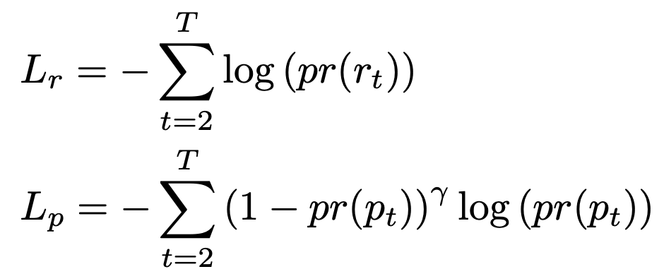 

- PD의 input으로 학습 시에는 ground truth rhythm sequence, 생성 시에는 RD로 생성된 rhythm sequence
- rhythm token은 확률 분포에서 샘플링
- pitch token도 top-5에서 샘플링
- 멜로디 생성을 위해서 주어진 chord sequence에 대해 첫 token은 휴리스틱하게 선택
    - 만약 첫 time-step에 chord가 없다면, rhythm과 pitch 모두 rest로 설정. 아니면 chord의 root note로 pitch 설정

### 3) Experiment Settings

- 1 phase (1P) training
    - single key data로 최대 1300 에폭 학습
- 2 phase (2P) training
    - first phase
        - pitch varied rhythm data와 loss term의 영향 분석
        - pitch varied data는 PV, single key data는 SK
        - loss term에 대해서는 rhythm only (RO), rhythm with pitch (RP)
        - loss term for RP는 L=Lr+Lp
    - second phase
        - single key data에 대해 100 에폭
        - 시작할 때 first phase에서 학습된 RD의 parameter 불러와서 시작, CE와 PD는 랜덤하게 초기화
- two baseline: vanilla transformer(self-attention block 여러 개로 구성된 CE와 PD), self-attention CE를 biLSTM으로 바꾼 모델

## **4. Result**

### **1) Quantitative Evaluation**

**1-1) Validation Accuracy**

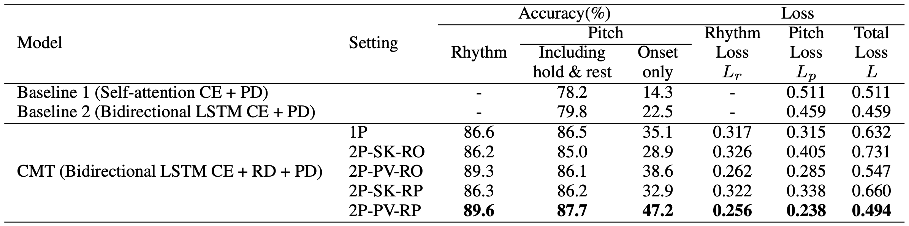 

**1-2) Chord Tone Ratio**

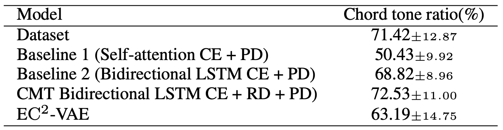 

**1-3) Rhythm Pattern Analysis**

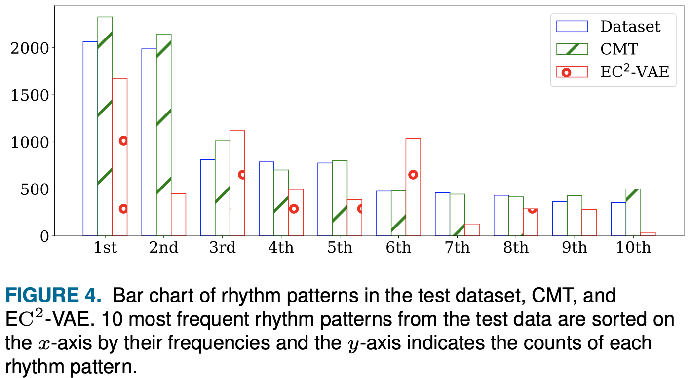 

### **2) Human Evaluation**

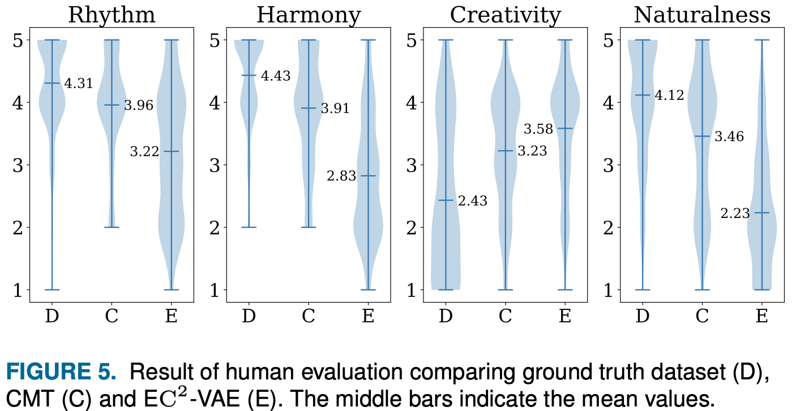 

## **Note**
