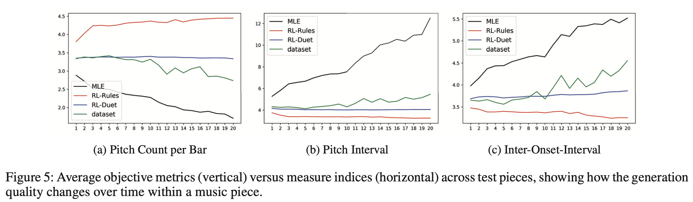

# [RL-Duet: Online Music Accompaniment Generation Using Deep Reinforcement Learning](https://aaai.org/ojs/index.php/AAAI/article/view/5413/5269)

AAAI 2020

## 0. Overview

* human이 멜로디를 즉석에서 연주하면, machine이 실시간으로 대위법 반주를 생성하는 online music accompaniment generation을 위한 모델인 RL-Duet
* RL-Duet은 reward 모델들의 결합을 통한 강화학습 모델
* human과 machine의 input 사이의 inter-part 및 intra-part 조화를 고려하여 reward model을 학습

## 1. RL-Duet

### 1) Motivation for Reinforcement Learning
* MLE 기반의 예측은 training과 testing 환경이 다르기 때문에 test 시 모델의 생성이 한 번 잘못되면 누적됨
* 또한 training 기준과 생성 목표가 다르기 때문에 생성된 sequence의 미래 token에 대한 long-term effect를 고려하지 못함
* 반면 RL을 이용하면 agent는 직접적으로 model prediction을 이용하여 시행착오를 통해 long-term discounted reward를 최대화시키는 방향으로 학습

 

### 2) Representation
* MIDI 데이터 사용, time을 16개의 note로 나눔, 각 pitch마다 별도의 "hold" 기호 사용, "rest" 기호 사용 (e.g. [C4, C4_hold, C4_hold, C4_hold])
* 비트 정보 활용, time을 16개의 note로 나누고 각 비트는 4가지 파트로 나눠짐 (e.g. B = [b0, b1, ..., bT])
* t 시점의 state는 human part와 machine part로 나뉨
* 생성 모델은 이전 time-step의 state에 기반한 machine 부분의 다음 token의 확률 분포인 p(mt|st)를 학습

### 3) RL Framework
* actor-critic with generalized advantage estimator (GAE), action policy와 value function 학습
* expected long-term discounted reward EπR를 최적화

 

* 학습 과정은 2단계를 반복: generation, reward
* generation 단계가 모두 끝나고 전체 음악이 다 연주되면, reward agent가 각 time-step의 reward를 계산하여 gradient 기반 update

 

### 4) Reward Model
* deep neural network로 4개의 reward model을 설계하고 ensemble
* machine 부분의 horizontal 시간적 일관성과 human part와 machine part 사이의 vertical 조화 관계를 동시에 고려하도록
  * Joint Modeling: 직접적으로 p(mt|st) 학습 / pre-context와 post-context를 동시에 고려하여 학습
  * Horizontal View: intra-part의 시간적 일관성을 위해 오직 machine part의 pre-context와 post-context 고려, 많은 monophonic music을 학습에 이용 가능
  * Vertical View: inter-part harmony를 capture, 오직 전체 human part와 machine part의 중앙 excerpt의 조화를 모델링
* note가 지나치게 반복되면 -1의 reward를 부여하는 간단한 rule-based reward 추가
* 각 time-step에서의 총 reward는 model-based reward와 rule-based reward의 합

## 2. Experiments

### 1) Experimental Setup
* Music21의 Bach Chorale 데이터셋(SATB 포맷)으로 학습, 한 chorale의 4파트 중 랜덤으로 human part와 machine part를 골라 duet 형성
* note token과 beat token을 encode하는 embeding layer -> bi-directional GRU -> 시간 정보를 결합하기 위한 pooling과 attention을 이용한 Temporal Context Summarizer -> current beat의 feature과 결합되어 확률 분포 출력
* 학습 과정은 먼저 reward model들이 MLE로 학습되고, 이를 고정시킨 뒤 generation model이 강화학습으로 학습됨
* machine part의 첫 두 마디는 ground-truth 악보로 주어짐

 

### 2) Objective Evaluation
* pitch count per bar (PC/bar), average pitch interval (PI), average inter-onset-interval (IOI), pitch class histogram (PCH) and note length histogram (NLH)

 

 

## Note
공개된 code가 없음
